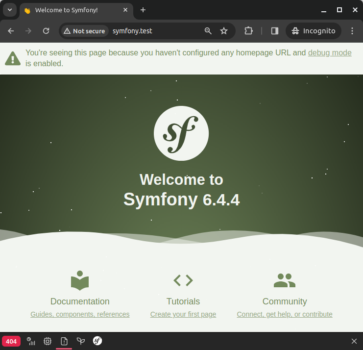
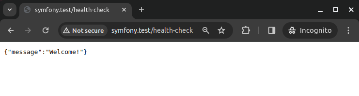
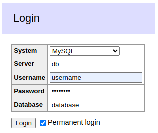
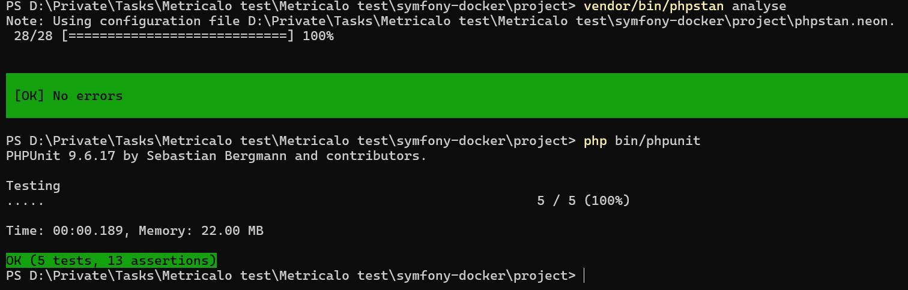

### **`README.md` (Docker Setup)**

```markdown
# Symfony Project - Docker Setup

> **For development use only, not for production!**

## **Technologies Used**

| Component   | Version                                       |
|------------|-----------------------------------------------|
| PHP        | `8.2`, `8.3`                                  |
| Database   | `MySQL 8.0`                                   |
| Server     | `Nginx 1.25`, `nginx-proxy 1.5`               |
| Tools      | `XDebug 3.3.1`, `Adminer`                     |

---

## **Setup Instructions**

### **Clone the Repository**

```bash
git clone git@github.com:amberlex78/symfony-docker.git && cd symfony-docker
```

### **Update Hosts File**

Add the following lines to your `/etc/hosts` file:

```bash
127.0.0.1 symfony.test
127.0.0.1 adminer.test
```

### **Configure MySQL**

```bash
cp compose.override.yaml.mysql compose.override.yaml && cp .env.mysql .env
```

### **Configure Environment Variables**

```bash
cp project/.env.dist project/.env
```

Ensure the correct `DATABASE_URL` is uncommented in `project/.env`.

---

## **Installation**

```bash
make install
```

After installation, open your browser and navigate to:

- **Symfony App:** [`http://symfony.test`](http://symfony.test)  
  

- **Health Check:** [`http://symfony.test/health-check`](http://symfony.test/health-check)  
  

---

## **Running Symfony Locally**

You can run the Symfony application using **PHP’s built-in server**:

```bash
php -S 127.0.0.1:8000 -t public
```

Then visit [`http://127.0.0.1:8000`](http://127.0.0.1:8000) in your browser.

---

## **Configuration**

Check the `.env` file for:

- `NGINX_VIRTUAL_HOST`
- `ADMINER_VIRTUAL_HOST`

---

## **Database Access**

### **MySQL via Adminer**

Visit [`http://adminer.test`](http://adminer.test) and use the following credentials:

```
Server:   db
Username: username
Password: password
Database: database
```



---

## **Makefile Commands**

To see available commands:

```bash
make
```

---

### **Example `/etc/hosts` for Multiple Projects**

```bash
127.0.0.1 example.test
127.0.0.1 project.test

127.0.0.1 symfony.test
127.0.0.1 laravel.test

127.0.0.1 adminer.test
```
```

---

### **`DEVELOPMENT.md` (Development Documentation)**

```markdown
# Development Documentation

This document provides details on the **code structure, design patterns, API, commands, and testing strategy** used in this Symfony project.

---

## **Code Structure**

project/
├── bin/
├── config/
├── public/
├── src/
│   ├── Command/
│   ├── CommandHandler/
│   ├── Controller/
│   ├── DTO/
│   ├── Event/
│   ├── EventListener/
│   ├── Message/
│   ├── MessageHandler/
│   ├── Repository/
│   ├── Service/
│   │   ├── CircuitBreaker/
│   │   ├── Payment/
│   │   ├── Retry/
│   └── Tests/
├── templates/
├── translations/
├── var/
└── vendor/


## **Design Patterns Used**

### 1. **Factory Pattern**
   - `PaymentServiceFactory` is used to create payment service instances (`Shift4PaymentService`, `AciPaymentService`).

### 2. **Command Pattern**
   - `ProcessPaymentCommand` and `ProcessPaymentCommandHandler` encapsulate payment processing logic.

### 3. **Event Listener Pattern**
   - `PaymentProcessedListener` handles payment processing events asynchronously.

### 4. **Circuit Breaker Pattern**
   - `CircuitBreaker` prevents failures from cascading when an external API is down.

### 5. **Retry Pattern**
   - `RetryService` attempts to retry failed external API calls with exponential backoff.

### 6. **DTO (Data Transfer Object)**
   - `PaymentRequest` and `PaymentResponse` help in structured data transfer between application layers.

---

## **API**

### **Payment Processing**

- **Endpoint:** `POST /app/example/{provider}`
- **Description:** Processes a payment using the specified provider (`shift4` or `aci`).

#### **Request Body Example:**

```json
{
  "amount": 100.00,
  "currency": "USD",
  "card_number": "4111111111111111",
  "card_exp_year": 2025,
  "card_exp_month": 12,
  "card_cvv": "123"
}
```

#### **Response Example:**

```json
{
  "transaction_id": "txn_12345",
  "created_at": "2023-10-01T12:34:56Z",
  "amount": 100.00,
  "currency": "USD",
  "card_bin": "411111",
  "provider": "shift4",
  "success": true,
  "error_message": null
}
```

---

## **Commands**

### **Process Payment Command**

- **Command:**
  ```bash
  bin/console app:example {provider} {amount} {currency} {card_number} {card_exp_year} {card_exp_month} {card_cvv}
  ```
- **Example:**
  ```bash
  bin/console app:example shift4 100.00 USD 4111111111111111 2025 12 123
  ```

---

## **Testing**

### **Unit Tests**

- **Location:** `src/Tests/`
- **Coverage:**
  - `PaymentServiceFactoryTest`: Ensures correct factory behavior.
  - `Shift4PaymentServiceTest`: Validates Shift4 payment processing.
  - `AciPaymentServiceTest`: Tests ACI integration.
  - `RetryServiceTest`: Ensures retry logic works as expected.

### **Functional Tests**

- **Location:** `src/Tests/Functional/`
- **Coverage:**
  - `PaymentControllerTest`: Validates the payment processing API.

### **Running Tests**

```bash
php bin/phpunit
```



---

## **Static Analysis with PHPStan**

PHPStan helps ensure code quality by catching potential issues early.

### **Configuration**

- **File:** `phpstan.neon`
- **Level:** `5`

### **Running PHPStan**

```bash
vendor/bin/phpstan analyse
```

---

## **CI/CD Integration**

To maintain code quality, integrate the following checks in your CI/CD pipeline:

1. **Run Tests**:
   ```bash
   php bin/phpunit
   ```

2. **Run PHPStan**:
   ```bash
   vendor/bin/phpstan analyse
   ```

3. **Check Coding Standards**:
   ```bash
   php-cs-fixer fix --dry-run
   ```

---

## **Conclusion**

This project follows **Symfony best practices** with a **modular architecture, design patterns, and robust testing**. The use of **PHPStan ensures high code quality**, and Docker simplifies local development.

For any issues or improvements, **please open an issue or submit a pull request**.
```
